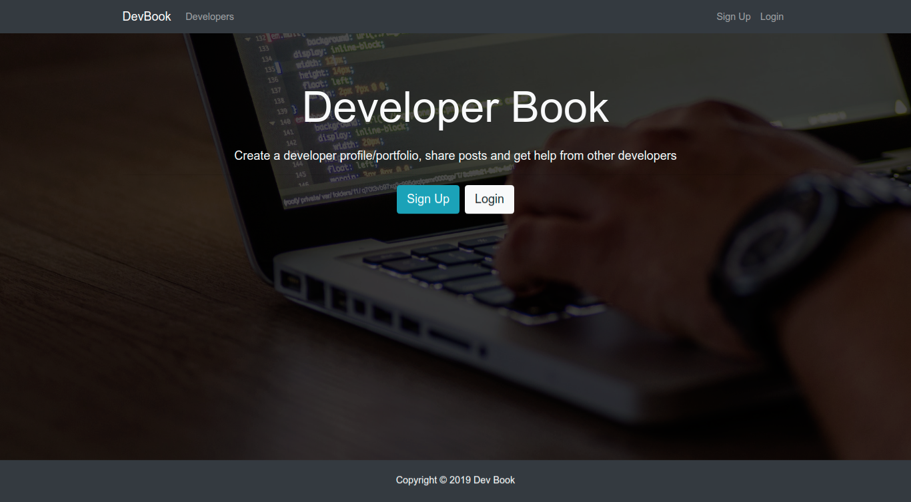
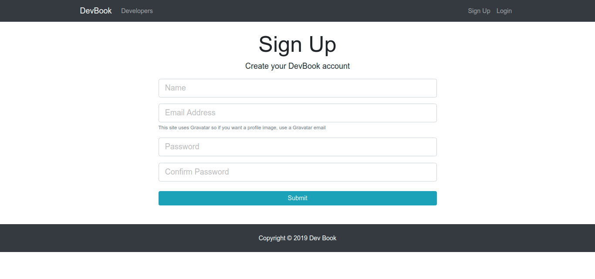
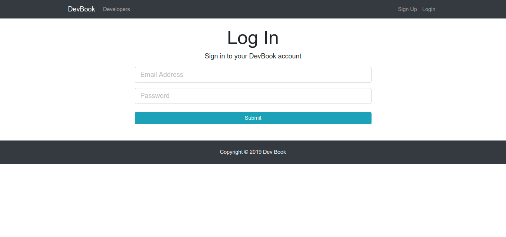
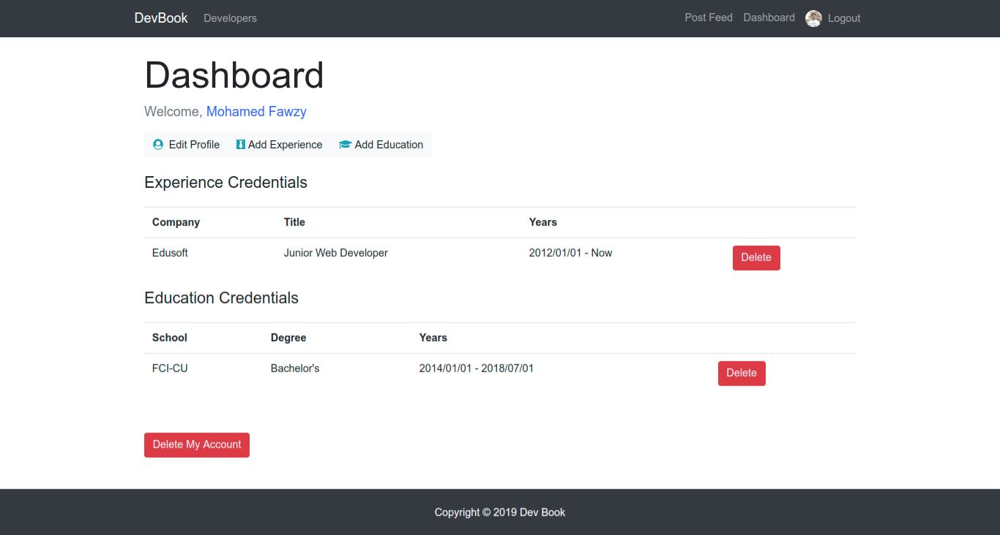
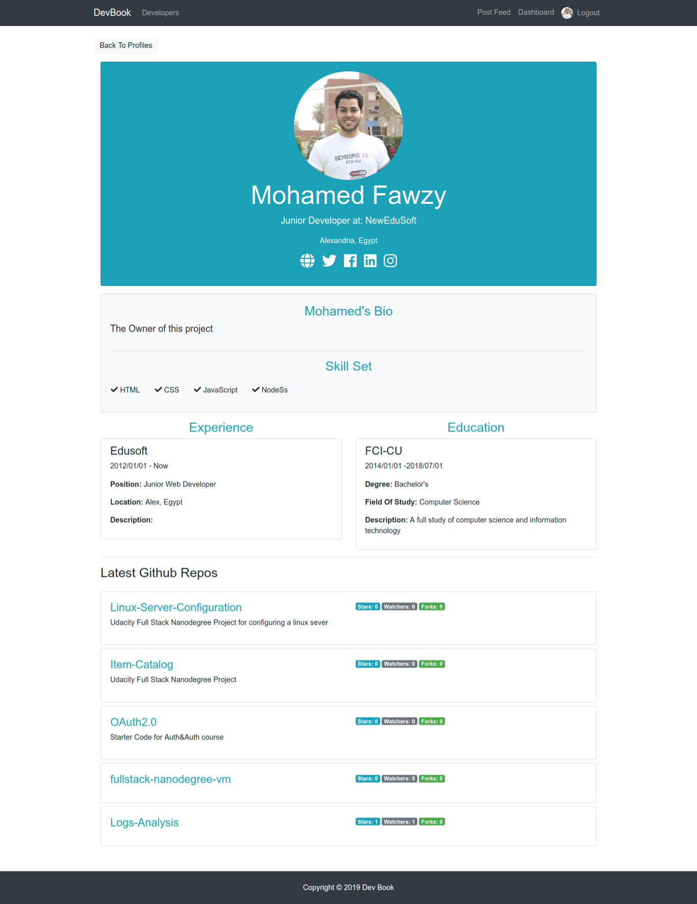
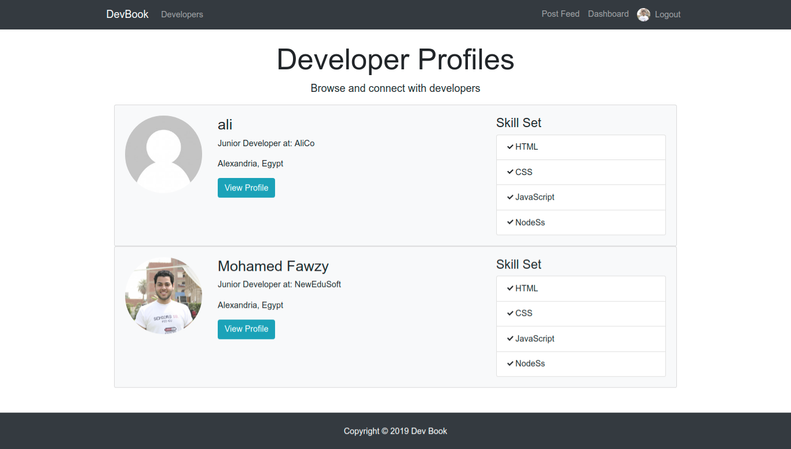
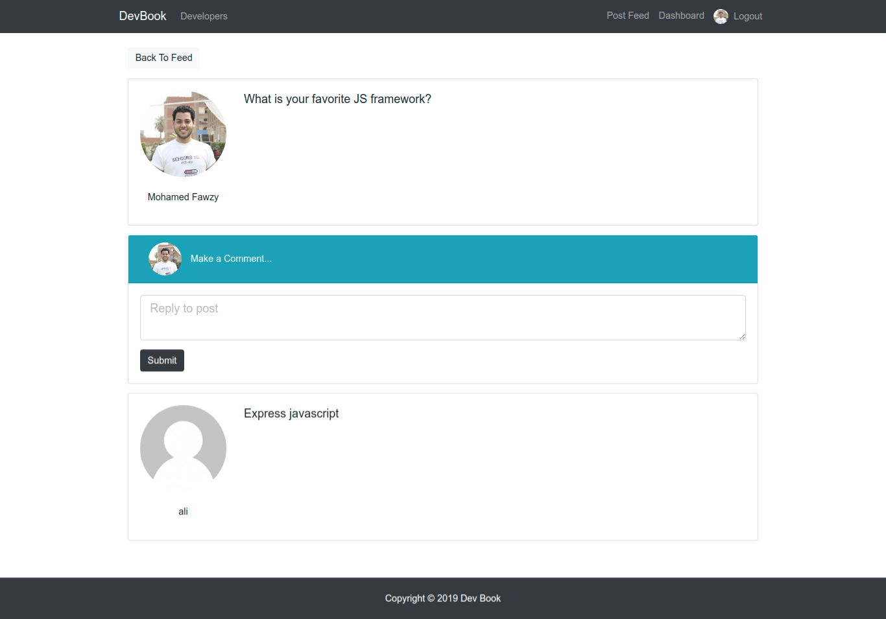

# DevBook

> By: Mohamed Fawzy

## About

A social network for developers - A full stack web application, built with MERN stack technologies.

User can have a detailed profile includes all of his/her information, add posts and comments and share it with the other users, can also add his/her experiences and educations, user can add his/her github user name to get the latest 5 created github repositories, and also can connect his/her social links like facebook, twitter, linkedin, instagram, and youtube.

A user need to sign up with a connected to gravatar email to be able to have a profile picture.

### Application link:

- [DevBook](https://dev-book-2019.herokuapp.com/)

### Skills used for this project

- NodeJS
- ReactJS
- MongoDB
- ExpressJS
- Bootstrap
- HTML
- CSS
- Javasript

##### --------------------------------------

##### User Interface Captures

##### --------------------------------------

Landing Page

Signup Page

Login Page

Dashboard

Profile

Edit Profile

Add Experience

Add Education

Developers

Post Feed

Post Page

- All rights deserved for [Brad Traversy](https://github.com/bradtraversy)
